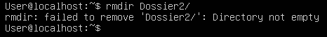

TP1

**Exercice 2 : Manuel**

1.  **A l'aide du manuel, identifiez le rôle de la commande which**

> La commande which permet de localiser une commande.

2.  **Quand on consulte une page du manuel, comment peut-on rechercher
    un terme (par exemple, chercher le terme option dans la page de
    manuel de which ?**

> which -a
>
> 

3.  **Comment quitte-t-on le manuel ?**

> En tapant sur la touche « q » du clavier

4.  **Chaque section du manuel a une première page, qui présente le
    contenu de la section. Afficher la première page de la section 6 ;
    de quoi parle cette section ?**

Cette section parle des jeux et des petits programmes amusants
disponibles sur le système.

**Exercice 3 : Navigation dans l'arborescence des fichiers**

1.  **allez dans le dossier /var/log**

2.  **remontez dans le dossier parent (/var) en utilisant un chemin
    relatif**

3.  **retournez dans le dossier personnel**

Pour retourner dans le dossier personnel, on peut utiliser soit la commande cd, soit la commande cd ~

4.  **revenez au dossier précédent (/var) sans utiliser de
    chemin**

Pour revenir au dossier précédent, on peut utiliser la commande cd -

5.  **essayez d'accéder au dossier /root ; que se passe-t-il ?**

Je n'ai pas la permission d'accéder au dossier /rout

6.  **essayez la commande sudo cd /root ; que se passe-t-il ?
    Expliquez**

cd est une commande shell intégré, sudo ne fonctionne que avec des
exécutables. cd n'est pas une commande qui se trouve dans
/usr/bin:/bin:/sbin/...

7.  **à partir de votre dossier personnel, créez l'arborescence suivante
    :**

8.  **revenez dans votre dossier personnel ; à l'aide de la commande rm,
    essayez de supprimer Fichier1, puis Dossier1 ; que se passe-t-il ?**

A l'aide de la commande rm le Fichier1.txt a été supprimé mais le
dossier Dossier1 ne peut pas être supprimé.

9.  **quelle commande permet de supprimer un dossier ?**

Pour supprimer un dossier vide il faut utiliser la commande rmdir suivie
le nom du dossier

10. **que se passe-t-il quand on applique cette commande à Dossier2 ?**

La commande rmdir ne peut pas supprimer un dossier qui n'est pas vide

11. **comment supprimer en une seule commande Dossier2 et son contenu
    ?**

La commande rm -r permet de supprimer Dossier2 et son contenu

**Commandes importantes**

1.  **Quelle commande permet d'afficher l'heure ? A quoi sert la
    commande time ?**

**La commande pour afficher l'heure est « date »**

**La commande time permet de déterminer le temps d'exécution d'une
certaine commande.**

2.  **Dans votre dossier personnel, tapez successivement les commandes
    ls puis la ; que peut-on en déduire sur les fichiers commençant par
    un point ?**

Les fichiers commençant par un point sont des fichiers cachés

3.  **Où se situe le programme ls ?**

La programme ls se situe dans /usr/bin/

4.  **Essayez la commande ll. Existe-t-il une entrée de manuel pour
    cette commande ? Utilisez les commandes alias ou alias pour en
    savoir plus sur la nature de cette commande.**

Il n'existe pas d'entrée manuel pour cette commande.

Donc la commande ll a été créé manuellement pour remplacer la commande
ls --alF

5.  **Quelle commande permet d'afficher les fichiers contenus dans le
    dossier /bin ?**

Pour afficher les fichiers contenus dans le dossier /bin il faut
utiliser la commande « ls /usr/bin/»

6.  **Que fait la commande ls .. ?**

La commande ls .. permet de lister les fichiers contenus dans le
répertoire parent.

7.  **Quelle commande donne le chemin complet du dossier courant ?**

La commande  « pwd » donne le chemin complet du dossier courant

8.  **Que fait la commande echo \'bip\' \> plop exécutée 2 fois ?**

Cette commande permet de créer un fichier plop en écrivant le texte bip
en une seule ligne si on exécute le fichier 2 fois.

9.  **Que fait la commande echo \'bip\' \>\> plop exécutée 2 fois ?**

Cette commande permet de créer un fichier plop en écrivant le texte bip
en deux ligne si on exécute le fichier 2 fois.

10. **Interprétez le comportement de la commande sleep 10 \| echo
    \'toto\' ?**

Cette commande permet d'afficher 'toto' pendant 10 seconde.

11. **A quoi sert la commande file ? Essayez-la sur des fichiers de
    types différents.**

La commande file permet de déterminer le type de fichier indépendamment
de son extension.

12. **Créez un fichier *original* qui contient la chaîne *Hello* *Toto*
    ! ; créer ensuite un lien *lien_phy* vers ce fichier avec la
    commande *ln* *original* *lien_phy*. Modifiez à présent le contenu
    de *original* et affichez le contenu de *lien_phy* : qu'observe-t-on
    ? Supprimez le fichier *original* ; quelle conséquence cela a-t-il
    sur *lien_phy* ?**

En modifiant le contenu de **original,** le contenu de **lien_phy** est
modifié également, donc dans les deux fichiers il y a le même contenu.

En supprimant le fichier **original,** le contenu de **lien_phy** n'a
pas été modifié et est accessible**.**

13. **Créez à présent un lien symbolique *lien_sym* sur *lien_phy* avec
    la commande *ln -s lien_phy* *lien_sym*. Modifiez le contenu de
    *lien_phy* ; quelle conséquence pour *lien_sym* ? Et inversement ?
    Supprimez le fichier *lien_phy* ; quelle conséquence cela a-t-il sur
    *lien_sym* ?**

> En modifiant le contenu de **lien_phy**, le contenu de **lien_sym** a
> également été modifié, et inversement en modifiant le contenu de
> **lien_sym**, le contenu de **lien_phy** a été modifié.
>
> Si on supprime le fichier **lien_phy**, le fichier **lien_sym**
> devient introuvable et inaccessible.

14. **Affichez à l'écran le fichier /var/log/syslog. Quels raccourcis
    clavier permettent d'interrompre et reprendre le défilement à
    l'écran ?**

« CTRL + S » permet d'interrompre et « CTRL + Q » permet de reprendre le
défilement à l'écran.

15. **Affichez les 5 premières lignes du fichier /var/log/syslog, puis
    les 15 dernières, puis seulement les lignes 10 à 20.**

Affichez les 5 premières lignes du fichier /var/log/syslog : head --5
/var/log/syslog 

Affichez les 15 dernières lignes : tail -15 /var/log/syslog

Afficher seulement les lignes 10 à 20 : head --20 /var/log/syslog \|
tail +10

16. **Que fait la commande dmesg \| less ?**

La commande dmesg \| less permet d'examiner ou contrôler le tampon
circulaire du noyau.

17. **Affichez à l'écran le fichier /etc/passwd ; que contient-il ?
    Quelle commande permet d'afficher la page de manuel de ce fichier
    ?**

Le fichier /etc/passwd contient toutes les informations relatives aux
utilisateurs (login, mots de passe, ...). Pour afficher la page de
manuel de ce fichier il faut utiliser la commande « less /etc/passwd ».

18. **Affichez seulement la première colonne triée par ordre
    alphabétique inverse**

cut -d \':\' -f 1 /etc/passwd \| sort -r

19. **Quelle commande nous donne le nombre d'utilisateurs ayant un
    compte sur cette machine (pas seulement les utilisateurs
    connectés)**

cat /etc/passwd \| wc -l

20. **Combien de pages de manuel comportent le mot-clé conversion dans
    leur description ?**

man -k conversion \| wc -l

21. **A l'aide de la commande find, recherchez tous les fichiers se
    nommant passwd présents sur la machine.**

sudo find / -type f -name passwd

22. Modifiez la commande précédente pour que la liste des fichiers
    trouvés soit enregistrée dans le fichier \~/list_passwd_files.txt et
    que les erreurs soient redirigées vers le fichier spécial /dev/null

23. Dans votre dossier personnel, utilisez la commande grep pour
    chercher où est défini l'alias ll vu précédemment.

L'allias ll est défini dans le fichier caché .bashrc à la ligne 91.

24. Utilisez la commande locate pour trouver le fichier history.log.

25. Créer un fichier dans votre dossier personnel puis utilisez locate
    pour le trouver. Apparaît-il ? Pourquoi ?

**Exercice 3 : Travailler avec plusieurs shells**

1.  cp /var/log/syslog /home/User

cp syslog log.txt

nano log.txt

2.  CTRL + W, CTRL + R, chercher le mot kernel + ENTRER, mettre le mot
    noyau + ENTRER, A pour remplacer toutes les occurrences.

3.  CTRL + K pour couper, CTRL + U pour copier

4.  CTRL + U pour annuler

5.  CTRL + S pour enregistrer, CTRL + X quitter nano

Exercice 4 : Personnalisation du shell

